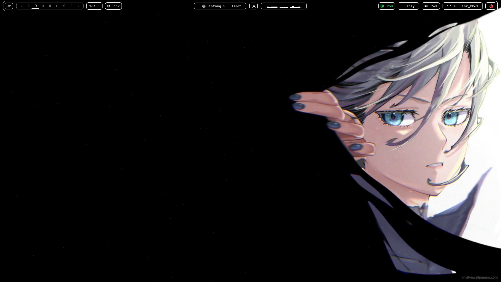

# Personal-Waybar
here is my personal waybar that im currently using on my hyprland setup
the cava i used for the waybar come from here https://github.com/ray-pH/waybar-cava

here's the screenshot for the waybar

and here's the screenshot for the fullscreen

note that you'll need these for the waybar to work

**-Btop (for the CPU)

-Wofi (for the app menu)

-Wlogout (for the power button to work)

-Swaync (for the notification center on the left side of the waybar)

-nmtui (for wifi control over kitty)

-alsamixer (for audio control over kitty also)

-nerd fonts**
